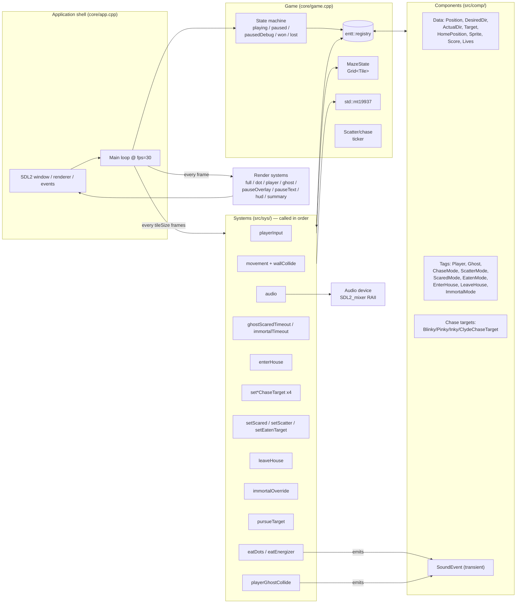
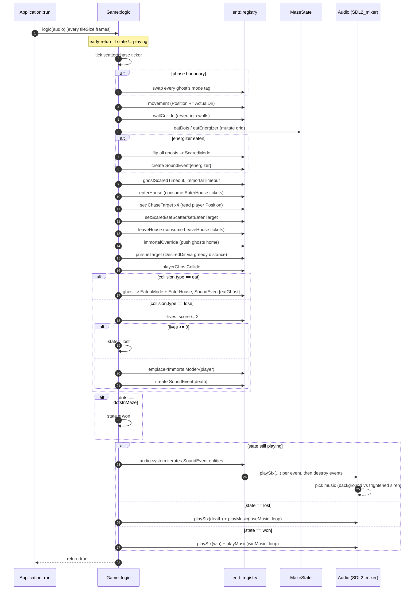

# EnTT-Pacman Architecture

## Table of Contents

- [Project Overview](#project-overview)
- [System Architecture](#system-architecture)
  - [Layered view](#layered-view)
  - [ECS shape](#ecs-shape)
  - [ECS structure](#ecs-structure)
  - [Two-rate game loop](#two-rate-game-loop)
  - [System order in `Game::logic`](#system-order-in-gamelogic)
  - [Game state machine](#game-state-machine)
- [Data Flow](#data-flow)
  - [Input → state](#input--state)
  - [Logic tick → world mutation](#logic-tick--world-mutation)
  - [Sound flow](#sound-flow)
  - [Render pass](#render-pass)
  - [One logic step, sequenced](#one-logic-step-sequenced)
  - [State outside the ECS (and why)](#state-outside-the-ecs-and-why)

## Project Overview

EnTT-Pacman is a Pac-Man clone written in C++17. It exists primarily as a tutorial for the ECS (Entity-Component-System) facilities of the [EnTT](https://github.com/skypjack/entt) framework, with SDL2 handling input and rendering and SDL2_mixer handling sound. EnTT 3.4.0 ships vendored under `third_party/entt`; pin to that API surface (`has`, `remove_if_exists`, classic `view.get`) and don't introduce calls from later releases.

Scope and deliberate simplifications:

- Single maze, no levels, no fruit, no extra-life, no intermissions.
- 152 dots, 4 ghosts (Blinky, Pinky, Inky, Clyde), classic scatter/chase/scared loop.
- Ghost AI is greedy nearest-tile pursuit, not A*. This matches the original arcade.
- Tunnel wrap-around and ghost-house door are special-cased with literal coordinates; they aren't modeled as entities.

Tech choices worth knowing up front:

- **EnTT** for the ECS. A single `entt::registry` owns every entity. Systems are stateless free functions in `src/sys/`.
- **SDL2** for window, renderer (hardware-accelerated, VSync), input. Logical resolution is fixed; the window is upscaled by an integer factor chosen at startup.
- **SDL2_mixer** for SFX and music, wrapped in an RAII `Audio` class.
- **CMake** out-of-source build into `build/`. C++17, warnings on for Debug.
- **Animera-generated sprites** baked into the binary as a compressed byte array (`util/sprites.{hpp,cpp}` — don't hand-edit).

Repository layout:

```
src/
  main.cpp           entry point
  core/              app, game, audio, maze, factories, constants
  comp/              components (plain structs, mostly aggregates)
  sys/               systems (free functions, one concept per file)
  util/              SDL helpers, Grid, Pos/Dir, generated sprites
third_party/entt/    vendored EnTT 3.4.0
audio/               .wav SFX and .ogg music, copied next to the binary
animations/          Animera sources for the sprite sheet
```

## System Architecture

### Layered view

Three layers, top-down:

1. **Application shell** (`core/app.cpp`) — owns SDL state: window, renderer, texture, audio device, the frame counter, the event pump. It instantiates `Game` and drives the main loop. This is the only place that touches SDL init/teardown.
2. **Game orchestrator** (`core/game.cpp`) — owns the `entt::registry`, the `MazeState`, the RNG, the run state machine (`playing | paused | pausedDebug | won | lost`), the global scatter/chase ticker, and the dot counter. Forwards input, sequences systems in `logic()`, and dispatches render passes.
3. **ECS world** (`comp/`, `sys/`) — components carry data, systems do work. Nothing here knows about SDL beyond the renderer/writer passed into the render systems.

### ECS shape

EnTT's contract is followed strictly:

- Components are plain data. Most are aggregates with no constructors; many are empty tag types. See `comp/player.hpp`, `comp/ghost.hpp`, `comp/ghost_mode.hpp`.
- Mode is modeled with **four mutually exclusive tag components** (`ChaseMode`, `ScatterMode`, `ScaredMode`, `EatenMode`) rather than an enum. This lets per-mode data live on the tag itself — `ScaredMode` carries a frightened-timer countdown. Changing mode is `remove<OldMode>` + `emplace<NewMode>`.
- Some tags are **tickets**: `EnterHouse`, `LeaveHouse`. The system that acts on the ticket removes it.
- Ghost AI is parameterized by **chase-target components** (`BlinkyChaseTarget`, `PinkyChaseTarget`, `InkyChaseTarget`, `ClydeChaseTarget`) that store the entities the ghost is hunting. One system per ghost computes the next `Target` tile.
- The maze itself sits **outside the ECS** as a `Grid<Tile>` in `MazeState`. Dots and energizers are tiles in that grid, not entities. The reasoning (single-player game, no per-player dot counts needed) is recorded in a comment in `game.cpp`.

### ECS structure



### Two-rate game loop

The single most important architectural idea. The main loop runs at `fps` (30) and splits work:

- `Game::logic()` runs **once every `tileSize` (8) frames**. One logic step moves an entity by exactly one tile. Positions are integer tile coordinates — no fractional pixels in the ECS.
- `Game::render()` runs **every frame** and is passed `frame % tileSize`, the sub-tile pixel offset, so sprites slide smoothly between tile positions.

`fps` is the game-speed knob: bump it and logic and render scale together. Don't repurpose `tileSize` as a speed knob — it doubles as the pixel size of a tile and as the render interpolation divisor.

### System order in `Game::logic`

The order is load-bearing — each system reads and writes shared component state, and reordering causes subtle bugs. The exact sequence:

1. Tick the scatter/chase phase counter, switch modes at the boundary.
2. `movement` — apply each entity's `ActualDir` to its `Position`.
3. `wallCollide` — undo movement that hit a wall.
4. `eatDots`, `eatEnergizer` — mutate the maze grid; `eatEnergizer` flips ghosts to scared.
5. `ghostScaredTimeout`, `immortalTimeout` — decrement timers, expire modes.
6. `enterHouse` — eaten ghosts that reach the door consume their `EnterHouse` ticket.
7. `set*ChaseTarget` (per ghost), `setScared`, `setScatter`, `setEatenTarget` — compute each ghost's `Target` tile for this tick.
8. `leaveHouse` — ghosts in the house consume their `LeaveHouse` ticket.
9. `immortalOverride` — when the player is immortal, push ghosts back toward home so they don't camp the spawn.
10. `pursueTarget` — pick `DesiredDir` greedily by straight-line distance to `Target` (no A*).
11. `playerGhostCollide` — resolve player/ghost overlap into `eat` (player has energizer) or `lose`.
12. End-of-tick win/lose check, lives decrement, score halving on death.
13. `audio` — flush queued `SoundEvent` entities and reconcile looping music (background vs frightened siren). Skipped on the same tick the game ends so the end-screen track isn't briefly stomped.

### Game state machine

| State | Logic runs? | Render | Audio |
|---|---|---|---|
| `playing` | yes | normal frame | `audio` system manages |
| `paused` (SPACE) | no (early return) | last frame + dim overlay + "PAUSED" text | `Audio::pauseAll` |
| `pausedDebug` (P) | no | last frame unchanged | `Audio::pauseAll` |
| `won` | no | win screen + summary | one-shot win SFX + looped win music |
| `lost` | no | lose screen + summary | one-shot death SFX + looped lose music |

`Game::input` returns `bool`; ESC returns `false`, and `Application::run` watches the return value to quit.

## Data Flow

### Input → state

1. SDL pumps events in `Application::run`. `SDL_KEYDOWN` is forwarded to `Game::input(audio, scancode)`.
2. `Game::input` handles meta-keys directly (ESC quits, SPACE/P toggle pause). Otherwise, only while `playing`, it calls `playerInput(reg, key)` which writes `DesiredDir` on the player entity.
3. `DesiredDir` is the player's *intent*; `ActualDir` is what they actually face. The split lets the player queue a turn before reaching a tile that allows it.

### Logic tick → world mutation

Within one `Game::logic` call:

- Mode ticker reads `ticks` and `scattering`, calls `ghostChase`/`ghostScatter` to swap every ghost's mode tag at the boundary.
- `movement` walks the view of moving entities and applies `ActualDir` to `Position`. `wallCollide` walks the same and reverts when the new tile is a wall (consulting the maze).
- Dot/energizer systems test the player's tile against `MazeState` and mutate the grid in place. Eating an energizer:
  - increments `dots` on `Game` (the win threshold) when it was a dot.
  - emits a `SoundEvent` (chomp or energizer).
  - flips every ghost to `ScaredMode` (eat energizer path).
- Per-ghost target systems compute the chase target tile. They read the player's `Position` via `reg.get<Position>(target)` rather than putting the player in their view.
- `pursueTarget` chooses the cardinal direction that minimizes Euclidean distance to `Target`, subject to `canMove`. No backtracking, no pathfinding.
- `playerGhostCollide` returns one of `{none, eat, lose}`. On `eat`, the ghost gets `EatenMode` + an `EnterHouse` ticket. On `lose`, `Game::logic` decrements `Lives`, halves `Score`, and either flips to `State::lost` or grants `ImmortalMode` and emits a death `SoundEvent`.

### Sound flow

Sound stays ECS-shaped. Systems don't call `Mix_PlayChannel` themselves:

1. A system that detects a sound-worthy event creates a throwaway entity carrying a `SoundEvent { SoundId }` component. The pattern mirrors the `EnterHouse`/`LeaveHouse` tickets.
2. `sys/audio.cpp` (last call in `Game::logic`) iterates every `SoundEvent`, plays the SFX, then destroys the event entities.
3. The same audio system also reconciles looping music: if any ghost has `ScaredMode`, play the frightened siren; otherwise play the background track. This is the one piece of "system reads aggregate world state" that doesn't fit the per-entity model — there's only one music channel.
4. `Game::init` plays the intro jingle directly. The end-game tracks (win/lose music) are also played directly by `Game::logic` on the state transition, and the audio system is skipped that tick so it doesn't restart the wrong loop.

### Render pass

`Application::run` calls `Game::render(renderer, writer, frame % tileSize)` every frame. The sub-tile offset is the only thing that varies between logic ticks:

- While `playing`, the current sub-tile frame is cached in `frozenFrame`. While paused, the cached value is reused so the freeze keeps the exact pixel position the player saw at press time.
- Pass order: full background → dots (from the grid) → player → ghosts → (pause overlay + text if `paused`) → HUD (lives, score). `won`/`lost` swap the background and draw a summary.

### One logic step, sequenced



### State outside the ECS (and why)

Three pieces of state live on `Game` rather than as components, each deliberate:

- **`MazeState`** — the static maze plus mutable dots/energizers. Conceptually a single shared resource; one grid is simpler than 152 dot entities.
- **`dots` counter** — the win threshold. Comment in `game.cpp` notes that multi-player would force this into a component.
- **`std::mt19937 rand`** — passed by reference to systems that need it (`setScaredTarget`). RNG is process-global state by nature.

The tunnel wrap and the ghost-house door are encoded as literal coordinates in `sys/movement.cpp` and `sys/can_move.cpp`. The code comments flag this as a deliberate shortcut — modeling them as entities was judged overkill.
